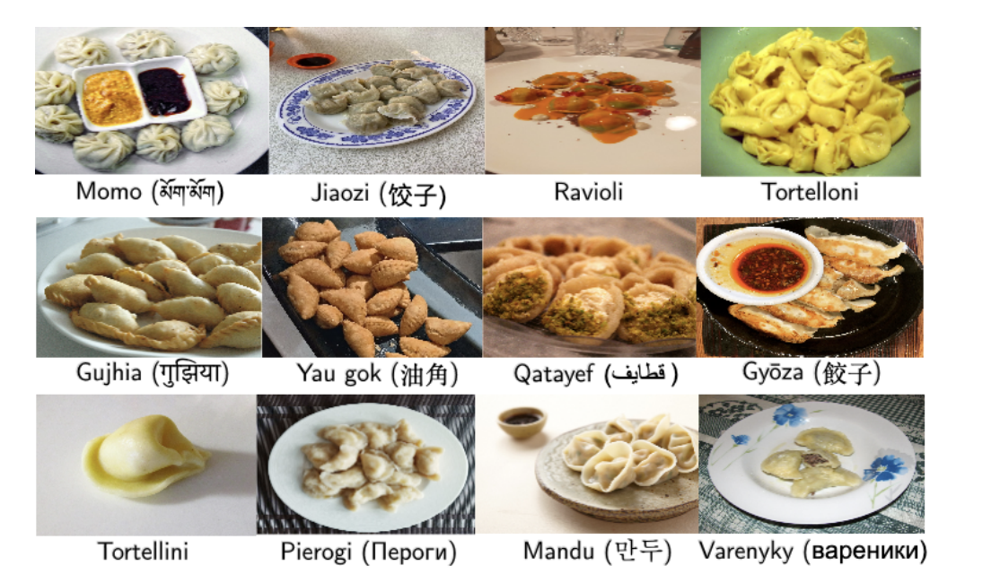

# 🥘 World Cuisine: Multilingual Multicultural VQA Benchmark
[](https://creativecommons.org/licenses/by-sa/4.0/)



Introducing **WorldCuisines 🥘**, a massive-scale multilingual and multicultural VQA benchmark that challenges Vision-Language Models (VLMs) to understand cultural food diversity in over **30 languages and dialects**, across **9 language families**, with over **1 million data points** available.

### Key Stats:
- **Over 1 Million** text-image pairs
- Coverage of **2.4k** dishes with **6k** images.
- Coverage of **30 languages** across **9 language families**


## Table of Contents

- [🥘 World Cuisine: Multilingual Multicultural VQA Benchmark](#-world-cuisine-multilingual-multicultural-vqa-benchmark)
    - [Key Stats:](#key-stats)
  - [Table of Contents](#table-of-contents)
  - [📜 Paper](#-paper)
  - [📊 Benchmark](#-benchmark)
  - [⚡ Environment Setup (TODO)](#-environment-setup-todo)
    - [Via `pip`](#via-pip)
    - [Via `conda`](#via-conda)
  - [💯 Experiment Result](#-experiment-result)
  - [🧪 Running Experiments (TODO)](#-running-experiments-todo)

## 📜 Paper 
This is the source code of the paper [[Arxiv]](https://arxiv.org/abs/2410.12705):

This code has been written using Python. If you use any code or datasets from this toolkit in your research, please cite the associated paper.
<pre>
Pending Google Scholar Indexing
</pre>

## 📊 Benchmark

WorldCuisines 🥘 comprises a balanced proportion of its **2 supported tasks**. We provide over **1M training data** and a **60k evaluation data**.


Our benchmark evaluates LMMs on two tasks: dish name prediction and dish location prediction. The settings include **no-context**, **contextualized**, and **adversarial** infused prompt as the model's input.


## ⚡ Environment Setup (TODO)

### Via `pip`
```
pip install -r requirements.txt
```
### Via `conda`
```
conda env create -f env.yml
```

## 💯 Experiment Result
If you wish to get the final result for all LMMs that we evaluate, please refer to this [leaderboard](https://huggingface.co/spaces/worldcuisines/worldcuisines) for the summary. The raw results are placed in the `evaluation/score/json` directory.

## 🧪 Running Experiments (TODO)
All experiment results will be stored in the `evaluation/result/` directory. You can execute each experiment using the following commands:

**TODO**

<!-- ### Bitext Retrieval
#### Cross-lingual setting
```
❱❱❱ python bitext.py --src_lang {src_lang} --dataset {dataset} --seed {seed} --cuda --model_checkpoint {model_checkpoint}
❱❱❱ python bitext.py --src_lang de --dataset bucc --seed 42 --cuda --model_checkpoint sentence-transformers/LaBSE
```

#### Ensemble
The arguments are similar as above, except we use `--model_checkpoints` and `--weights`
```
❱❱❱ python bitext.py --src_lang {src_lang} --dataset {dataset} --seed {seed} --cuda --model_checkpoint {model_checkpoint}
❱❱❱ python bitext.py --src_lang de --dataset bucc --seed 42 --cuda --model_checkpoint sentence-transformers/LaBSE
```

### Retrieval-based Classification
#### Monolingual setting
```
❱❱❱ python classification.py --dataset {dataset} --seed {seed} --cuda --model_checkpoint {model_checkpoint}
❱❱❱ python classification.py --dataset nusax --seed 42 --cuda --model_checkpoint sentence-transformers/LaBSE
```

#### Cross-lingual setting
Add `--src_lang` and `--cross` to the command.
```
❱❱❱ python classification.py --src_lang {src_lang} --cross --dataset {dataset} --seed {seed} --cuda --model_checkpoint {model_checkpoint}
❱❱❱ python classification.py --src_lang eng --cross --dataset nusax --seed 42 --cuda --model_checkpoint sentence-transformers/LaBSE
```

#### Ensemble
The arguments are similar as above, except we use `--model_checkpoints` and `--weights`
```
❱❱❱ python classification.py --dataset {dataset} --seed {seed} --cuda --model_checkpoints {model_checkpoint1} {model_checkpoint2} {...} --weights {weight1} {weight2} {...}
❱❱❱ python classification.py --dataset nusax --seed 42 --cuda --model_checkpoints sentence-transformers/LaBSE intfloat/multilingual-e5-large --weights 0.25 0.75
```

### ICL Classification
#### Monolingual setting
```
❱❱❱ python icl.py --dataset {dataset} --seed 42 --instruction {instruction} --model_checkpoint {model} --gen_model_checkpoint {gen_model_checkpoint}  --cuda --load_in_8bit --k {k}
❱❱❱ python icl.py --dataset nusax --seed 42 --instruction "Generate a sentiment label for a given input.\nPlease only output the label." --model_checkpoint sentence-transformers/LaBSE --gen_model_checkpoint meta-llama/Meta-Llama-3-8B-Instruct  --cuda --load_in_8bit --k 1
```

#### Cross-lingual setting
Add `--src_lang` and `--cross` to the command.
```
❱❱❱ python icl.py --src_lang {src_lang} --cross --dataset {dataset} --seed 42 --instruction {instruction} --model_checkpoint {model} --gen_model_checkpoint {gen_model_checkpoint}  --cuda --load_in_8bit --k {k}
❱❱❱ python icl.py --src_lang eng --cross --dataset nusax --seed 42 --instruction "Generate a sentiment label for a given input.\nPlease only output the label." --model_checkpoint sentence-transformers/LaBSE --gen_model_checkpoint meta-llama/Meta-Llama-3-8B-Instruct  --cuda --load_in_8bit --k 1
```

## 📈 Aggregating Experiment Results
Add `--k` to modify the number of retrieved samples.
```
❱❱❱ python script/aggregate/aggregate_bitext_mining.py --k {k}
❱❱❱ python script/aggregate/aggregate_classification.py --k {k}
❱❱❱ python script/aggregate/aggregate_classification_cross.py --k {k}
❱❱❱ python script/aggregate/aggregate_icl.py --k {k}
❱❱❱ python script/aggregate/aggregate_icl_cross.py --k {k}
❱❱❱ python script/aggregate/aggregate_icl_percentile.py --k {k}
```

## 🏞️ Visualizing the Embeddings
```
❱❱❱ python visualize.py --model_checkpoint {model_checkpoint} --dataset {dataset} --seed {seed} --cuda
❱❱❱ python visualize.py --model_checkpoint sentence-transformers/LaBSE --dataset nusax --seed 42 --cuda
```

### Examples of the visualization by class labels: LaBSE (left) and XLM-R BASE (right)
 

### Examples of the visualization by sample ID: LaBSE (left) and XLM-R BASE (right)
 

## 💻 Models Support
Our codebase supports the usage of multiple models for the experiments, providing flexibility for customization beyond the list shown below:
### Encoder LMs and APIs
#### Open-source LMs:
- [sentence-transformers/LaBSE](https://huggingface.co/sentence-transformers/LaBSE)
- [sentence-transformers/use-cmlm-multilingual](https://huggingface.co/sentence-transformers/use-cmlm-multilingual)
- [intfloat/multilingual-e5-base](https://huggingface.co/intfloat/multilingual-e5-base)
- [intfloat/multilingual-e5-large](https://huggingface.co/intfloat/multilingual-e5-large)
- [sentence-transformers/paraphrase-multilingual-mpnet-base-v2](https://huggingface.co/sentence-transformers/paraphrase-multilingual-mpnet-base-v2)
- [microsoft/Multilingual-MiniLM-L12-H384](https://huggingface.co/microsoft/Multilingual-MiniLM-L12-H384)
- [cis-lmu/glot500-base](https://huggingface.co/cis-lmu/glot500-base)
- [FacebookAI/xlm-roberta-base](https://huggingface.co/FacebookAI/xlm-roberta-base)
- [FacebookAI/xlm-roberta-large](https://huggingface.co/FacebookAI/xlm-roberta-large)

#### Commercial embedding APIs (last tested as of June 2024)
- Cohere-Embedv3
- OpenAI-Embedv3

### Generative LMs:
- BLOOMZ [bigscience/bloomz-560m](https://huggingface.co/bigscience/bloomz-560m) [bigscience/bloom-1b7](https://huggingface.co/bigscience/bloom-1b7) [bigscience/bloomz-3b](https://huggingface.co/bigscience/bloomz-3b)
- mT0 [bigscience/mt0-xl](https://huggingface.co/bigscience/mt0-xl)
- XGLM [facebook/xglm-564M](https://huggingface.co/facebook/xglm-564M) [facebook/xglm-2.9B](https://huggingface.co/facebook/xglm-2.9B)
- Aya-23 [CohereForAI/aya-23-8B](https://huggingface.co/CohereForAI/aya-23-8B)
- Aya-101 [CohereForAI/aya-101](https://huggingface.co/CohereForAI/aya-101)
- Gemma 1.1 Instruct [google/gemma-1.1-7b-it](https://huggingface.co/google/gemma-1.1-7b-it)
- Llama 3 8B Instruct [meta-llama/Meta-Llama-3-8B-Instruct](https://huggingface.co/meta-llama/Meta-Llama-3-8B-Instruct)
- Llama 3 8B Instruct [meta-llama/Meta-Llama-3.1-8B-Instruct](https://huggingface.co/meta-llama/Meta-Llama-3.1-8B-Instruct)
- GPT models  (last tested as of June 2024)
- Cohere Command R  (last tested as of June 2024)


## 🚀 How to Contribute?
Feel free to create [an issue](https://github.com/gentaiscool/miners/issues/) if you have any questions. And, create [a PR](https://github.com/gentaiscool/miners/pulls) for fixing bugs or adding improvements (i.e., adding new datasets or models). 

If you are interested to create an extension of this work, feel free to reach out to [us](mailto:gentaindrawinata@gmail.com)!

Support our open source effort ⭐

## On Progress
We are improving the code to make it more user-friendly and customizable. We have created a new repository for implementing DistFuse, which is available at [https://github.com/gentaiscool/distfuse/](https://github.com/gentaiscool/distfuse/). You can install it by running `pip install distfuse`. Later, it will be integrated to this repository. -->